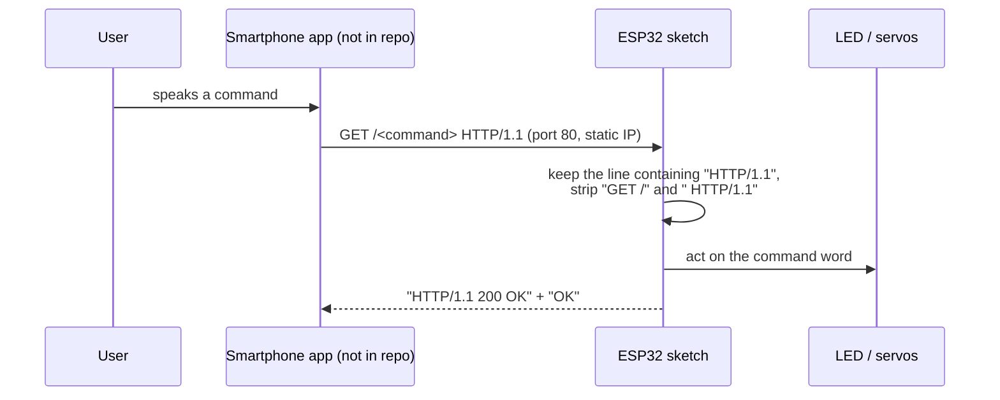

# Voice-Controlled ESP32 over Wi-Fi (`reconocimiento_de_voz`)

Arduino sketches from 2019 for an ESP32-class board that joins a Wi-Fi network, runs a small HTTP server on port 80, and reacts to single-word commands sent by a smartphone app. The sketch file is named `reconocimiento_de_voz` ("voice recognition"). The phone presumably turned speech into a command word and sent it as a URL path, such as `http://<board-ip>/prender`. The board then switches an LED on, off or blinking. The last version drives servos for an animatronic.

> **Original implementation.** This repository keeps the original code of the project. The source code has deliberately not been refactored or modernized, so the historical context and the original way of building it are kept.

---

## Project Context

| Item | Status | Details |
|---|---|---|
| Project origin | **Unknown** | No assignment, report or course material exists in the repository. The original README title was `Modular_Arduino`. "Modular" *may* refer to an academic integrative project, but nothing confirms it. See [docs/project-context.md](docs/project-context.md). |
| Period | Confirmed | Every commit was made between 2019-11-18 and 2019-11-20 (UTC−06:00). |
| Contributors | Confirmed | `ArodPre` wrote the first version (v1). `OBaruch` wrote v2–v4. |
| Target hardware | Inferred | An ESP32 board: `<WiFi.h>`, a comment that calls the board "ESP", and GPIO 18/19/21/23. |
| Companion phone app | Unknown | The comments mention a smartphone app. The app itself is not in the repository. |

## Problem Statement

*Inferred from code and comments:* control a physical device (first an LED, later servos) with spoken commands from a smartphone. Wi-Fi and plain HTTP link the phone and the board, so no extra hardware such as a Bluetooth module or voice-recognition shield is needed.

## Objective

- **v1:** prove the end-to-end chain: phone app → HTTP request → ESP32 → LED (`prender`, `apagar`, `parpadear`).
- **v2–v3:** use a custom vocabulary (`navidad`, `hora`, `luces`, `baila`, `no`, `si`) on a different network.
- **v4 (`AnimatronicoVersionDos`):** drive three servos so that an animatronic can react to commands. Only `no` has an implementation (a head-shake-like sweep on one servo).

## Repository Structure

```
.
├── README.md                     ← you are here
├── AGENTS.md                     ← rules for automated contributors (preservation constraint)
├── .gitignore
├── src/                          ← ORIGINAL CODE, byte-for-byte, one folder per historical version
│   ├── v1-led-voice-commands/reconocimiento_de_voz/reconocimiento_de_voz.ino   (was master)
│   ├── v2-custom-commands/reconocimiento_de_voz/reconocimiento_de_voz.ino      (was branch patch-1)
│   ├── v3-extended-commands/reconocimiento_de_voz/reconocimiento_de_voz.ino    (was branch patch-2)
│   └── v4-animatronic-servos/reconocimiento_de_voz/reconocimiento_de_voz.ino   (was branch patch-3)
└── docs/
    ├── project-context.md        ← origin, evidence, confirmed / inferred / unknown
    ├── code-overview.md          ← what each sketch does, request flow, HTTP protocol
    ├── version-history.md        ← how the versions differ and where they came from
    ├── possible-improvements.md  ← known issues, NOT applied
    ├── sdlc/                     ← intent.md, spec.md, plan.md for this reorganization
    └── original/README.original.md
```

Each sketch sits in a folder with the same name as the file (`reconocimiento_de_voz/`) because the Arduino IDE requires that layout to open a sketch.

## Original Implementation

The `.ino` files have not been changed. They still contain the original logic, style, names, comments, bugs and hard-coded values. That includes the Wi-Fi credentials and IP settings, which this documentation does not repeat. The files were only moved:

- `v1` was moved with `git mv`, so `git log --follow` still shows its history.
- `v2`–`v4` were copied unchanged from the heads of the old `patch-1`, `patch-2` and `patch-3` branches. Their SHA-256 hashes match the source blobs; the list is in [docs/version-history.md](docs/version-history.md).

## Technologies

| Technology | Status |
|---|---|
| C++ / Arduino sketch (`.ino`) | Confirmed |
| Arduino `WiFi.h` API (`WiFi`, `WiFiServer`, `WiFiClient`, `IPAddress`) | Confirmed |
| Arduino `Servo.h` API (v4 only; `attach()` return value is checked) | Confirmed usage. Which ESP32 servo library supplied it is **Unknown**. |
| ESP32 + Arduino core for ESP32 | Inferred |
| HTTP/1.1 over TCP, port 80 | Confirmed |
| Smartphone voice-recognition app | Referenced in comments. Platform and tool are **Unknown**. |

## How It Works



1. `setup()` connects to a hard-coded Wi-Fi network, applies a static IP, prints the IP on the serial port (115200 baud) and starts `WiFiServer` on port 80.
2. `loop()` waits for a client and reads the request line. It removes the first 5 characters (`GET /`) and the last 9 (` HTTP/1.1`), which leaves only the command word.
3. The word is compared with a fixed list of `if` statements, which drive GPIO 23 (LED) or, in v4, the servos on GPIO 18/19/21.
4. The board always replies with `200 OK` and the body `OK`, then closes the connection.

Details for each version are in [docs/code-overview.md](docs/code-overview.md).

## Inputs and Outputs

| Version | Input: command words (URL path) | Output |
|---|---|---|
| v1 | `prender`, `apagar`, `parpadear` | LED on GPIO 23: on / off / blink twice |
| v2 | `navidad`, `hora`, `luces`, `baila` | LED on / off / blink / blink |
| v3 | v2 + `no`, `si` | LED blink for the new words |
| v4 | `navidad`, `hora`, `luces`, `baila`, `no`, `si` | Only `no` does something: it sweeps servo index 2 (GPIO 21) up and back. The other branches are empty. |

The serial monitor shows connection progress, the assigned IP and, depending on the version, `respuesta` or the parsed command.

## Running the Project

The repository has no build configuration, so these steps are **inferred**, not confirmed:

1. Install the Arduino IDE with the ESP32 board package. v4 also needs a library that provides `Servo.h` for ESP32; the exact library is unknown.
2. Open the folder of the version you want, for example `src/v1-led-voice-commands/reconocimiento_de_voz/`.
3. The SSID, password, static IP, gateway and subnet are hard-coded in the sketch. Changing them for another network means editing a *local copy*. Keep the committed originals as they are.
4. Upload the sketch and open the serial monitor at **115200** baud to read the IP.
5. Send a command from any HTTP client, for example `http://<board-ip>/prender`. The original phone app is not available.

## Documentation

- [Project context](docs/project-context.md): origin, evidence and open questions
- [Code overview](docs/code-overview.md): walkthrough of each sketch and the protocol
- [Version history](docs/version-history.md): v1 → v4 and the archived branches
- [Possible improvements](docs/possible-improvements.md): documented only, not applied
- [Original README](docs/original/README.original.md)
- Reorganization records: [intent](docs/sdlc/intent.md) · [spec](docs/sdlc/spec.md) · [plan](docs/sdlc/plan.md)

## Historical Note

This repository was reorganized and documented later to make it easier to read and to keep the historical context of the original project. The original source code is unchanged. Versions that existed only on unmerged branches were brought into `src/` so that they stay visible. Their exact commits are also kept as `archive/*` git tags when the old branches are closed (see [version history](docs/version-history.md#branch-cleanup)).
