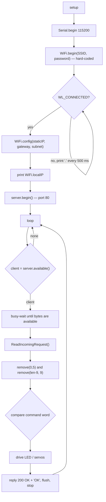

# Code Overview

This page describes the original sketches **as they are**. None of the code was changed. Line references point to the files in `src/`.

All four versions share one skeleton. v1 is described in full; for later versions only the differences are listed.

## Shared skeleton



### Global state (Confirmed)

| Symbol | Type | Role |
|---|---|---|
| `ledVerde` | `#define` = `23` | GPIO pin of the "green LED" |
| `ClientRequest` | `String` | Request line, reduced to the command word |
| `staticIP`, `gateway`, `subnet` | `IPAddress` | Static network settings |
| `server` | `WiFiServer(80)` | HTTP listener |
| `client` | `WiFiClient` | Current connection |
| `myresultat` | `String` | Last line seen that contains `HTTP/1.1` |

### `String ReadIncomingRequest()`

It reads the client's data line by line, using `readStringUntil('\r')`. Each line that contains `HTTP/1.1` at a position > 0 is stored in `myresultat`, and the function returns `myresultat`. In practice that line is the request line, for example `GET /prender HTTP/1.1`.

Observed side effects:

- It uses the globals `client` and `ClientRequest` rather than parameters.
- `myresultat` is never reset. If a request contains no `HTTP/1.1` line, the previous command is returned again (inferred from the code).

### Extracting the command

```
"GET /prender HTTP/1.1"
 ^^^^^         ^^^^^^^^^
 remove(0,5)   remove(len-9, 9)
        → "prender"
```

This works only for `GET` requests whose path has one segment and no query string (inferred).

### Response

Every request gets the same reply, `HTTP/1.1 200 OK`, `Content-Type: text/html`, blank lines and the body `OK`, whether the command was recognized or not. The Portuguese comment says the "OK" is meant for browsers, and that the app does not display it.

---

## v1: `src/v1-led-voice-commands/`

*Author: ArodPre, 2019-11-18. Was: `master`.*

| Command | Action |
|---|---|
| `prender` ("turn on") | `digitalWrite(23, HIGH)` |
| `apagar` ("turn off") | `digitalWrite(23, LOW)` |
| `parpadear` ("blink") | HIGH/LOW twice, 500 ms apart (≈ 2 s, blocking) |

Other details:

- Prints `respuesta` to serial for every request.
- Comments marked `Estas lineas se comentan para dejar la configuracion de IP dinamica` explain how to switch to DHCP: comment out the `IPAddress` globals and the `WiFi.config(...)` call.
- Static IP `192.168.0.25`. The comment says the phone app must use the same IP.

## v2: `src/v2-custom-commands/`

*Author: OBaruch, 2019-11-19, commit `Cmabio_de_ip_variables`. Was: `patch-1`.*

Changes from v1:

- A different Wi-Fi network and static IP `192.168.43.211`, with the URL written as a comment.
- The command set was replaced:

| Command | Action |
|---|---|
| `navidad` | LED on |
| `hora` | LED off |
| `luces` | LED blinks twice |
| `baila` | LED blinks twice |

## v3: `src/v3-extended-commands/`

*Author: OBaruch, 2019-11-19. Was: `patch-2`.*

Same as v2, plus `no` and `si`, each of which blinks the LED twice. The LED patterns look like placeholders until real actuators are wired (inferred).

## v4: `src/v4-animatronic-servos/`

*Author: OBaruch, 2019-11-20, commit `AnimatronicoVersionDos`. Was: `patch-3`.*

A cleaner rewrite of v3 that adds servo control:

- `#include <Servo.h>`, `static const int servosPins[3] = {18, 19, 21}`, `Servo servos[3]`.
- `setServos(int degrees, int s)` writes `(degrees + 35*s) % 180` to servo `s`. Each servo therefore gets a fixed 35° offset for its index.
- `setup()` attaches the three servos and prints `Servo <i>attach error` if an attach fails. `Serial.begin(115200)` is called twice.
- The Portuguese comments were replaced by Spanish section banners (`ESTABLECER IP`, `VARIABLES DE SERVOS`, `CONECTAR A WIFI`, `COMANDOS`, …).
- The parsed command is printed to serial instead of `respuesta`.
- Commands:

| Command | Action |
|---|---|
| `no` | Servo index 2 (GPIO 21) sweeps upward (0, 20, …, 160) and then downward (179, 159, …, 19), 20 ms per step, printing each position. Because of the offset, the angle actually written is `(pos + 70) % 180`. |
| `navidad`, `hora`, `luces`, `baila`, `si` | Empty bodies (not implemented) |

- `ledVerde` is still declared and configured as an output, but it is never written.

## Dependencies observed

| Dependency | Where | Notes |
|---|---|---|
| `WiFi.h` | all | Arduino / ESP32 core Wi-Fi API |
| `Servo.h` | v4 | `attach()` is used as a boolean, a behavior of some ESP32 servo libraries. The exact library is **Unknown**. |

No other files, libraries or configuration exist.
