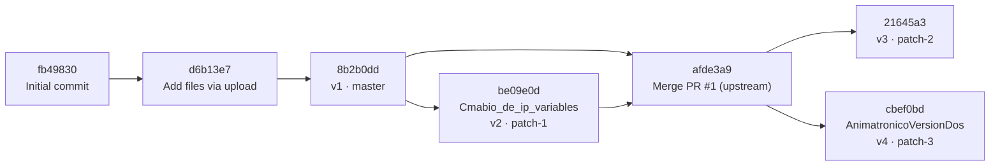

# Version History

Before the reorganization, the project's code was spread across `master` and three branches that were never merged. All four states are now kept side by side in `src/`. They are byte-identical copies of the original blobs.



`patch-1` pointed at `be09e0d`. `patch-2` and `patch-3` both start from merge commit `afde3a9`, which was created in the upstream repository of `ArodPre` (`Merge pull request #1 from OBaruch/patch-1`). That merge commit is not on this repository's `master`.

## Version map

| Version | Folder | Source ref | Commit | Author | Date | SHA-256 of `.ino` |
|---|---|---|---|---|---|---|
| v1 | `src/v1-led-voice-commands/` | `master` | `8b2b0dd` | ArodPre | 2019-11-18 | `f5663240be57e564b4ca22e06731c7245c81778979116f4de820d3be973b2606` |
| v2 | `src/v2-custom-commands/` | `patch-1` (tag `archive/patch-1`) | `be09e0d` | OBaruch | 2019-11-19 | `785e75b4ff63069821b8b2d39100e67ec3623211bc8587ef12ff08611f9de22b` |
| v3 | `src/v3-extended-commands/` | `patch-2` (tag `archive/patch-2`) | `21645a3` | OBaruch | 2019-11-19 | `718100b9188dd544fdf40a2964a059c245f103a3d964c8a36704347350ddddc9` |
| v4 | `src/v4-animatronic-servos/` | `patch-3` (tag `archive/patch-3`) | `cbef0bd` | OBaruch | 2019-11-20 | `a217d10f9d8056f60caef402a95c3551d96f1a322d21c42718ba265eb22183a3` |

To check that a file is identical to its source:

```bash
git show archive/patch-3:reconocimiento_de_voz.ino | sha256sum
sha256sum src/v4-animatronic-servos/reconocimiento_de_voz/reconocimiento_de_voz.ino
```

## What changed between versions

| From → To | Change |
|---|---|
| (upload) → v1 | Commit `8b2b0dd` added Spanish comments that explain how to switch to dynamic IP (DHCP) |
| v1 → v2 | New Wi-Fi network and static IP (`192.168.43.211`); commands `prender/apagar/parpadear` replaced by `navidad/hora/luces/baila` |
| v2 → v3 | Added commands `no` and `si` (LED blink placeholders) |
| v2 → v4 | Servo support (3 servos on GPIO 18/19/21) plus a rewrite of the comments and layout; `no` drives a servo sweep; the other commands become empty |

## Branch cleanup

The three `patch-*` branches were stale (last commit in November 2019), had no open pull requests, and were not merged into `master`. Their content is kept in two ways:

1. **As files:** the `src/v2-*`, `src/v3-*` and `src/v4-*` folders.
2. **As history:** the annotated tags `archive/patch-1`, `archive/patch-2` and `archive/patch-3` point to the exact branch heads. Commits and authorship stay reachable after the branches are deleted.

Commands to archive and close the branches (the tags must be pushed *before* the branches are deleted):

```bash
git fetch origin patch-1 patch-2 patch-3
for b in patch-1 patch-2 patch-3; do
  git tag -a "archive/$b" "origin/$b" -m "Archived head of stale branch $b"
done
git push origin archive/patch-1 archive/patch-2 archive/patch-3
git push origin --delete patch-1 patch-2 patch-3
```

To restore a branch later: `git switch -c patch-3 archive/patch-3`.
